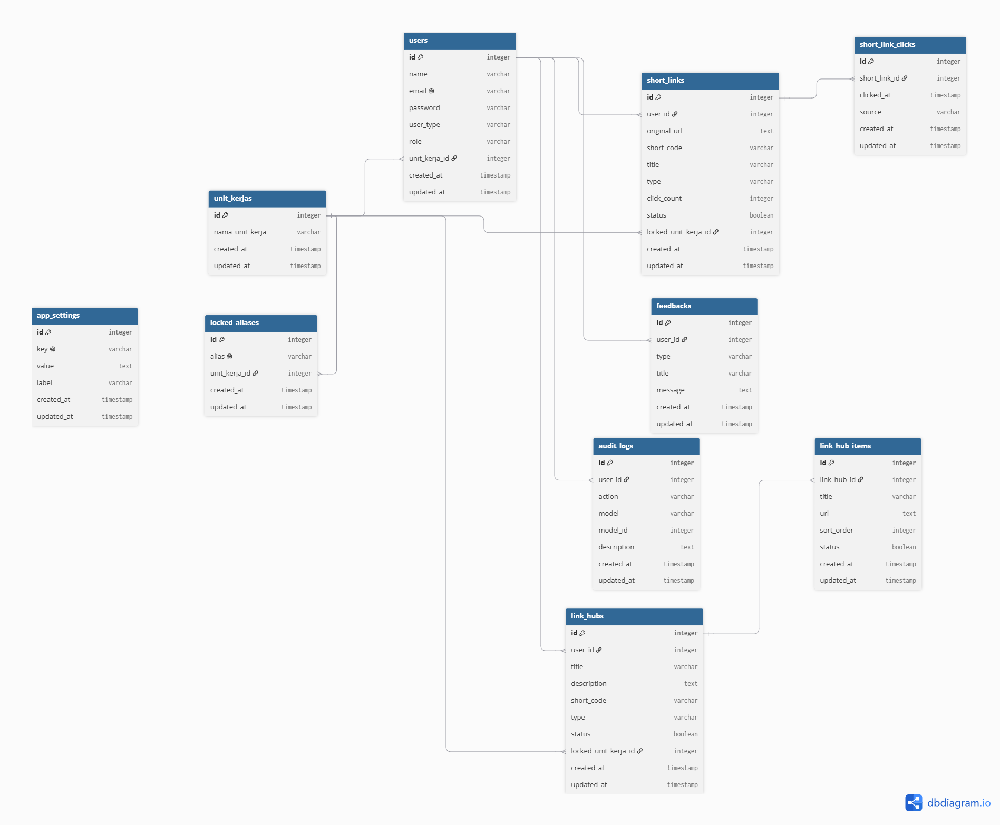

# Database Schema PENINK

Dokumentasi struktur database **PENINK — URL Shortener & Link Hub Kabupaten Landak**.

---

## Diagram Entity-Relationship

---

## Ringkasan Tabel

| No | Nama Tabel | Deskripsi |
|----|------------|-----------|
| 1 | `users` | Data pengguna (UMUM / ASN, role, unit kerja) |
| 2 | `unit_kerjas` | Master data unit kerja Pemkab Landak |
| 3 | `short_links` | Short link yang dibuat pengguna |
| 4 | `short_link_clicks` | Log klik pada setiap short link |
| 5 | `link_hubs` | Link Hub / Pohon Link |
| 6 | `link_hub_items` | Item link di dalam Link Hub |
| 7 | `feedbacks` | Saran & masukan dari pengguna |
| 8 | `locked_aliases` | Alias terkunci per unit kerja |
| 9 | `app_settings` | Konfigurasi aplikasi (versi, dll) |
| 10 | `audit_logs` | Log aktivitas penting |

---

## Detail Tabel Utama

### 1. users
Data pengguna PENINK.
- `user_type`: UMUM / ASN
- `role`: user / admin / super_admin
- `unit_kerja_id`: FK ke unit_kerjas

### 2. unit_kerjas
Master data unit kerja Pemkab Landak.
- `nama_unit_kerja`: Nama OPD
- Kompatibel dengan API BATIK LANDAK

### 3. short_links
Short link yang dibuat pengguna.
- `locked_unit_kerja_id`: Kunci akses OPD

### 4. link_hubs
Link Hub / Pohon Link.
- `locked_unit_kerja_id`: Kunci akses OPD

### 5. link_hub_items
Item link di dalam Link Hub.

### 6. short_link_clicks
Log klik pada setiap short link.

### 7. feedbacks
Saran & masukan dari pengguna.

### 8. locked_aliases
Alias terkunci untuk OPD tertentu.

### 9. app_settings
Konfigurasi aplikasi (versi, dll).

### 10. audit_logs
Log aktivitas penting.

---

## Relasi Antar Tabel

users (1) ─── (N) short_links ─── (N) short_link_clicks
users (1) ─── (N) link_hubs ─── (N) link_hub_items
users (1) ─── (N) feedbacks
users (1) ─── (N) audit_logs
unit_kerjas (1) ─── (N) users
unit_kerjas (1) ─── (N) locked_aliases

---

© 2026 Diskominfo Kabupaten Landak